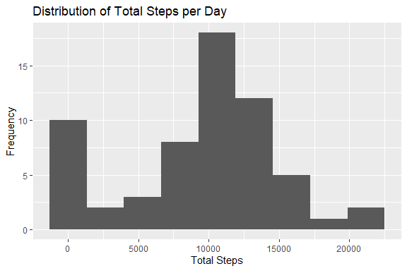

## Loading and preprocessing the data

```r
library(tidyverse)
```

```
## -- Attaching packages --------------------------------------- tidyverse 1.3.1 --
```

```
## v ggplot2 3.3.5     v purrr   0.3.4
## v tibble  3.1.3     v dplyr   1.0.7
## v tidyr   1.1.3     v stringr 1.4.0
## v readr   2.0.0     v forcats 0.5.1
```

```
## -- Conflicts ------------------------------------------ tidyverse_conflicts() --
## x dplyr::filter() masks stats::filter()
## x dplyr::lag()    masks stats::lag()
```

```r
library(ggplot2)
library(gridExtra)
```

```
## 
## Attaching package: 'gridExtra'
```

```
## The following object is masked from 'package:dplyr':
## 
##     combine
```

```r
activity <- read.csv("activity.csv")

# change type of steps to numeric
activity$steps <- as.numeric(activity$steps)

# ensure date is interpreted as a Date
activity$date <- as.Date(as.character(
  strptime(activity$date, "%Y-%m-%d")))
```


## What is mean total number of steps taken per day?

```r
steps <- activity %>%
  group_by(date) %>%
  summarise(total = sum(steps, na.rm=TRUE))

ggplot(steps, aes(x = total)) +
  geom_histogram(bins = 9) +
  ggtitle("Distribution of Total Steps per Day") +
  xlab("Total Steps")
```

<!-- -->

```r
steps_mean <- mean(steps$total)
steps_median <- median(steps$total)
```
Using the functions "mean()" and "median()" on the calculated dataframe "steps", over the column "total". We find that

- Mean = 9354.2295082
- Median = 1.0395\times 10^{4}

## What is the average daily activity pattern?

```r
interval_mean <- activity %>%
  group_by(interval) %>%
  summarise(mean = mean(steps, na.rm=TRUE))

ggplot(interval_mean, aes(x = interval, y = mean)) +
  geom_line(size = 1, colour = "slateGrey") + 
  ggtitle("Average Steps during the Day") + 
  xlab("Time") + ylab("Steps") + 
  scale_x_continuous(
    breaks = c(0, 300, 600, 900, 1200, 1500, 1800, 2100, 2400),
    labels = c("00:00", "03:00", "06:00", "09:00", "12:00",
               "15:00", "18:00", "21:00", "00:00"))
```

<!-- -->
The time at which the maximum number of steps occurs is at 08:35 with 206.1698113

## Imputing missing values


```r
number_of_NA <- sum(is.na(activity$steps))

# To replace the missing values, we'll use the median
# of that interval. So we must first find said medians
interval_medians <- activity %>%
  group_by(interval) %>%
  summarise(median = median(steps, na.rm=TRUE))

# split the data in NA and true
activity_na <- activity %>% filter(is.na(steps))
activity_tr <- activity %>% filter(!is.na(steps))

# replace the NA step values with the medians.
# 8 days of NA, so we repeated the steps 8 times
activity_na$steps <- rep(interval_medians$median, 8)

# combine the NA and true data to complete, then order
activity_complete <- rbind(activity_tr, activity_na) %>%
  arrange(date, interval)


steps_complete <- activity_complete %>%
  group_by(date) %>%
  summarise(total = sum(steps, na.rm=TRUE))

ggplot(steps_complete, aes(x = total)) +
  geom_histogram(bins = 9) +
  ggtitle("Distribution of Total Steps per Day") +
  xlab("Total Steps")
```

<!-- -->

```r
steps_mean_complete <- mean(steps_complete$total)
steps_median_complete <- median(steps_complete$total)
```

The data as missing 2304 2304 values, which is 8 days. (2304 / 288) 

We split the data into two separate dataframes, one without NA rows and the other with Only NA rows.

We find the median values for each interval, then knowing there is 8 days missing, repeat these values 8 times.

We can then assign these repeated interval medians to the NA data.

We then combine the two split dataframes back into one and sort by date then interval. A comparison of true values confirms.

We find that the Mean and Median of the complete data is

- Mean = 9503.8688525
- Median = 1.0395\times 10^{4}

We can see that our new values have raised the Mean, yet have had no impact on the Median.


## Are there differences in activity patterns between weekdays and weekends?

```r
# Assigning weekday name to each date
activity_complete$day <- as.factor(
  weekdays(activity_complete$date))

# Mean values for each interval for weekend
weekend <- activity_complete %>%
  filter(day %in% c("Saturday", "Sunday")) %>%
  group_by(interval) %>%
  summarise(mean = mean(steps))

# Mean values for each interval for weekdays
weekday <- activity_complete %>%
  filter(!(day %in% c("Saturday", "Sunday"))) %>%
  group_by(interval) %>%
  summarise(mean = mean(steps))


wend <- ggplot(weekend, aes(x = interval, y = mean)) +
  geom_line(size = 1, colour = "slateGrey") + 
  ggtitle("Weekend") + 
  xlab(NULL) + ylab("Steps") + 
  scale_x_continuous(
    breaks = c(0, 300, 600, 900, 1200, 1500, 1800, 2100, 2400),
    labels = c("00:00", "03:00", "06:00", "09:00", "12:00",
               "15:00", "18:00", "21:00", "00:00"))

wday <- ggplot(weekday, aes(x = interval, y = mean)) +
  geom_line(size = 1, colour = "slateGrey") + 
  ggtitle("Weekday") + 
  xlab("Time") + ylab("Steps") + 
  scale_x_continuous(
    breaks = c(0, 300, 600, 900, 1200, 1500, 1800, 2100, 2400),
    labels = c("00:00", "03:00", "06:00", "09:00", "12:00",
               "15:00", "18:00", "21:00", "00:00"))

grid.arrange(wend, wday)
```

<!-- -->

From the graph above, we can see that on a Weekday, this individual is much more active around 06:00, however is more sedentry from 09:00 to 18:00. On both Weekend and Weekday we can see a dip at 09:00, a dip just after 12:00, and a dip shortly after 18:00. As these are common mealtimes, it would not be far-fetched to attribute that this is the same.
